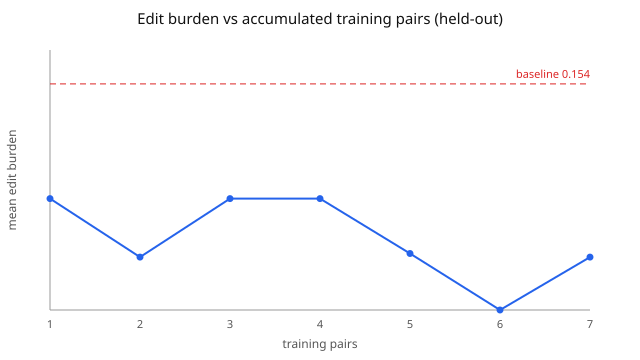

# Part 2: Learning from Doctor Edits — Result

Best-of-N selection driven by a reward model that learns the editor's style from accumulated (draft, edited) pairs. Edit burden is the mean section-level normalized edit distance between a draft and its reviewed form (lower is better).

- Training pairs: 7
- Held-out sections: 5
- Baseline edit burden (agent's own draft): **0.154**
- After learning (best-of-N): **0.036**
- Reduction: **0.118** (77% lower edit burden)
- Unsafe candidates blocked by the safety gate: 0

## Improvement curve (held-out)

| training pairs | mean edit burden | safety retention |
|---:|---:|---:|
| 1 | 0.076 | 100% |
| 2 | 0.036 | 100% |
| 3 | 0.076 | 100% |
| 4 | 0.076 | 100% |
| 5 | 0.038 | 100% |
| 6 | 0.000 | 100% |
| 7 | 0.036 | 100% |

Safety retention is the fraction of held-out sections whose flags and documented values survived selection. It stays at 100%: the curve is not bought by dropping flags or getting vaguer, because the safety gate makes any such candidate unselectable.

